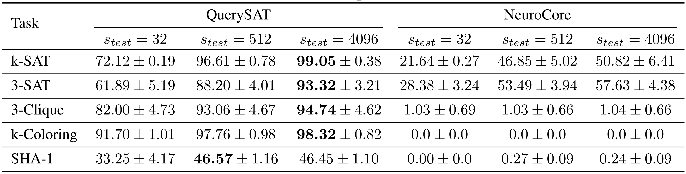
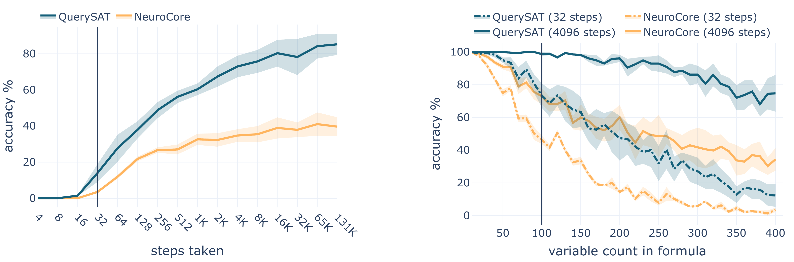
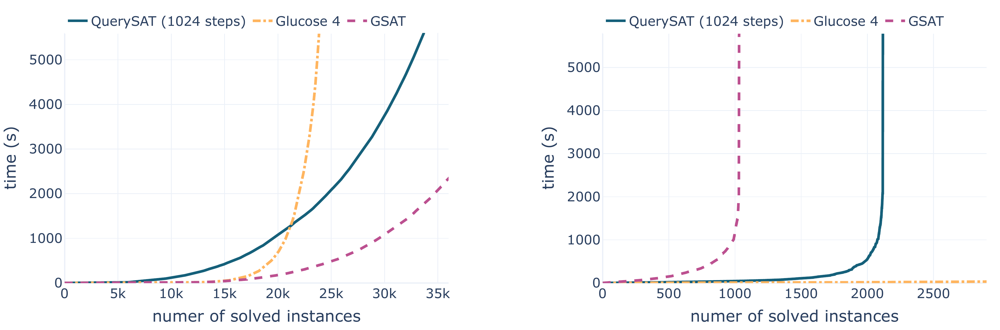

# Goal-Aware Neural SAT Solver

This repository contains the official TensorFlow implementation of the following paper:
> **Goal-Aware Neural SAT Solver**
> 
> by  Emils Ozolins, Karlis Freivalds, Andis Draguns, Eliza Gaile, Ronalds Zakovskis, Sergejs Kozlovics 
> 
> [[arXiv]](https://arxiv.org/abs/2106.07162)
> 
>  Abstract: _Modern neural networks obtain information about the problem and calculate the output solely from the input values. We argue that it is not always optimal, and the network's performance can be significantly improved by augmenting it with a query mechanism that allows the network to make several solution trials at run time and get feedback on the loss value on each trial. To demonstrate the capabilities of the query mechanism, we formulate an unsupervised (not dependant on labels) loss function for Boolean Satisfiability Problem (SAT) and theoretically show that it allows the network to extract rich information about the problem. We then propose a neural SAT solver with a query mechanism called QuerySAT and show that it outperforms the neural baseline on a wide range of SAT tasks and the classical baselines on SHA-1 preimage attack and 3-SAT task._


The proposed query mechanism works by producing a query, evaluating it using an unsupervised loss function, and passing the resulting value back to the neural network for interpretation. It allows the model to obtain the structure and meaning of the solvable instance and information about the expected model output. The same unsupervised loss can be used for evaluating the query and for training. Query mechanism conceptually is given as:


## Requirements

To install requirements run:

```sh
pip install -r requirements.txt
```

## Hardware requirements

* Ubuntu 20.04 or newer
* Nvidia T4 (16Gb) or better
* 16GB of RAM

## Training

To train models as in the paper, run this command:
```sh
python3 -u main.py --train --model <model_name> --task <task_name>
```
This command will generate data in `/host-dir/data` for the task and train the selected model. 
The model checkpoints are saved in `/host-dir/querysat/<timestamp>`, you can pass `--label <name>` to the run command add a name to checkpoints directory.
You can always change both directories in the `config.py` file.

A valid model names are:
* `querysat` - for the QuerySAT;
* `neurocore` - for the NeuroCore;
* `neurocore_query` - for the NeuroCore with added query mechanism.

By default, models are trained with 32 recurrent steps and evaluated with 64 steps. If you want to use other step counts for training or evaluation, please, change
`train_rounds` and `test_rounds` respectively in the model file. 

A valid task names are:
* `ksat` - for the k-SAT task with 3 to 100 variables;
* `3sat` - for the 3-SAT task consisting of hard formulas with 5 to 100 variables;
* `kcolor` - for the k-Color task for graphs with 4 to 40 vertices;
* `clique` - for the 3-Clique task for graphs with 4 to 40 vertices;
* `sha2019` - for the SHA-1 preimage attack from the [SAT Race 2019](http://sat-race-2019.ciirc.cvut.cz/) with 2-20 message bits.

A more detailed description of tasks and models are given in the [paper](https://arxiv.org/abs/2106.07162).
If you want to tweak any other aspects, please, modify `config.py`, the appropriate model file in `models\` or data file in `data\`.

## Evaluation

The trained model from the checkpoint can be evaluated on test set as follows:

```sh
python3 -u main.py --evaluate --task <task_name> --model <model_name> --restore <checkpoint_directory>
```
By default, test sets for training and evaluating is generated with the same variable count. If you want to evaluate on larger formulas
please change `min_vars` and `max_vars` in generator code in suitable data generator `/data/`.

To evaluate models variable-wise and step-wise generalization simply replace `--evaluate` with `--evaluate_variable_gen` and `--evaluate_round_gen`, respectively. The `--evaluate_variable_gen` will test model performance on the formulas with 10 to 400 variables. The `--evaluate_round_gen`, on the other hand, will test how model performance changes given more recurrent steps (by default from 16 to 1024). The evaluation results for step-wise and variable generalization will be output in the `checkpoint_directory`.

## Example
To reproduce the 3-SAT results as in paper, run:
```sh
python3 -u main.py --train --evaluate_variables_gen --evaluate_round_gen --task 3-sat --model querysat
```

## Results

We compare QuerySAT (our model) that utilizes query mechanism with standard NeuroCore message passing architecture on various SAT tasks.
Both models were trained with 32 recurrent steps for 500k training iterations and then tested with 32, 512, and 4096 recurrent steps.
The mean test accuracy (higher is better) as per cent of fully solved instances from the test set over 3 consecutive runs is shown in the following table:


On the 3-SAT task, we verify the generalization capabilities of QuerySAT and NeuroCore. First, we validate step-wise generalization (left image below) by evaluating models trained with 32 recurrent steps with 4 to 131k steps on 3-SAT formulas with 400 variables. We also check (right image below) how models with 32 and 4096 recurrent steps at test time generalize on formulas with up to 400 variables.



QuerySAT architecture is also compared with GSAT local-search algorithm and conflict-driven clause learning Glucose 4 solver. The results are given for the 3-SAT task (left image below) and the SHA-1 preimage attack task (right image below). QuerySAT outperforms Glucose 4 solver on the 3-SAT task and GSAT on the SHA-1 task giving a reasonable middle ground.


## Contributing
For help or issues, please submit a GitHub issue.
For personal communications, please contact Emīls Ozoliņš (emils.ozolins@lumii.lv).
